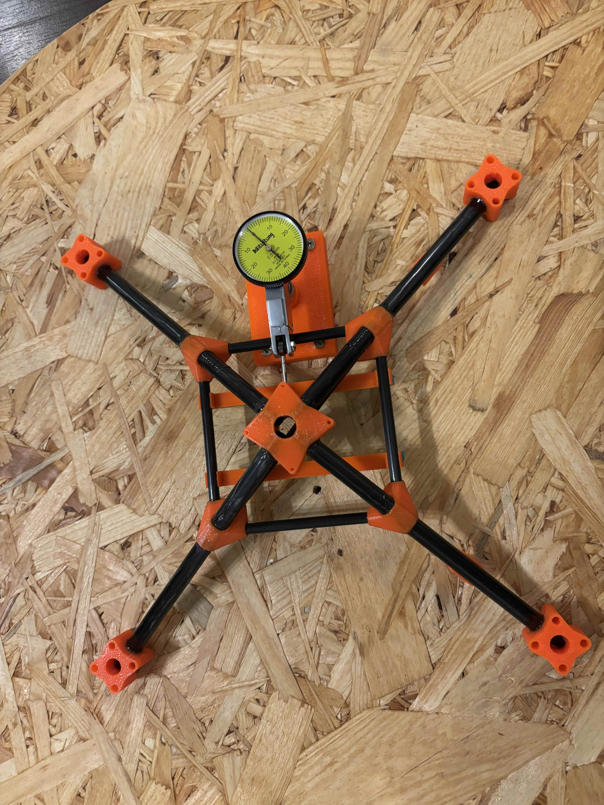
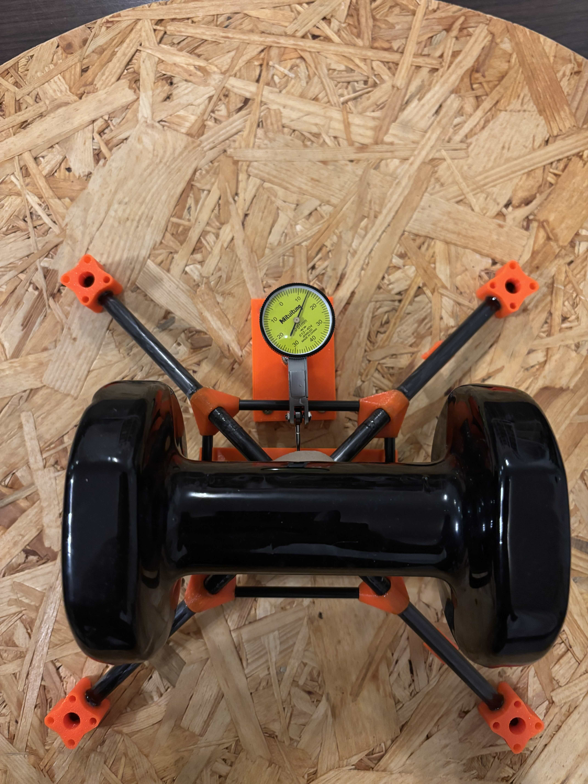
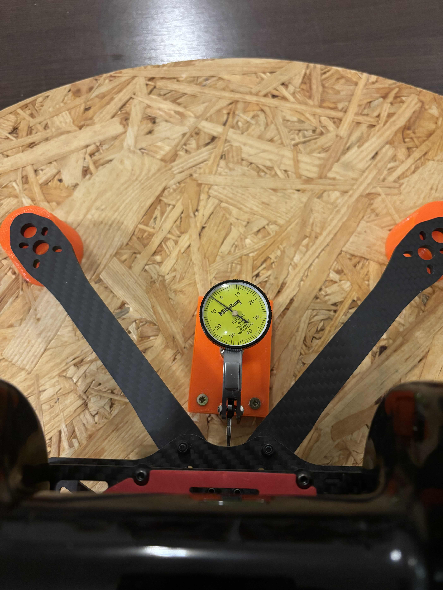
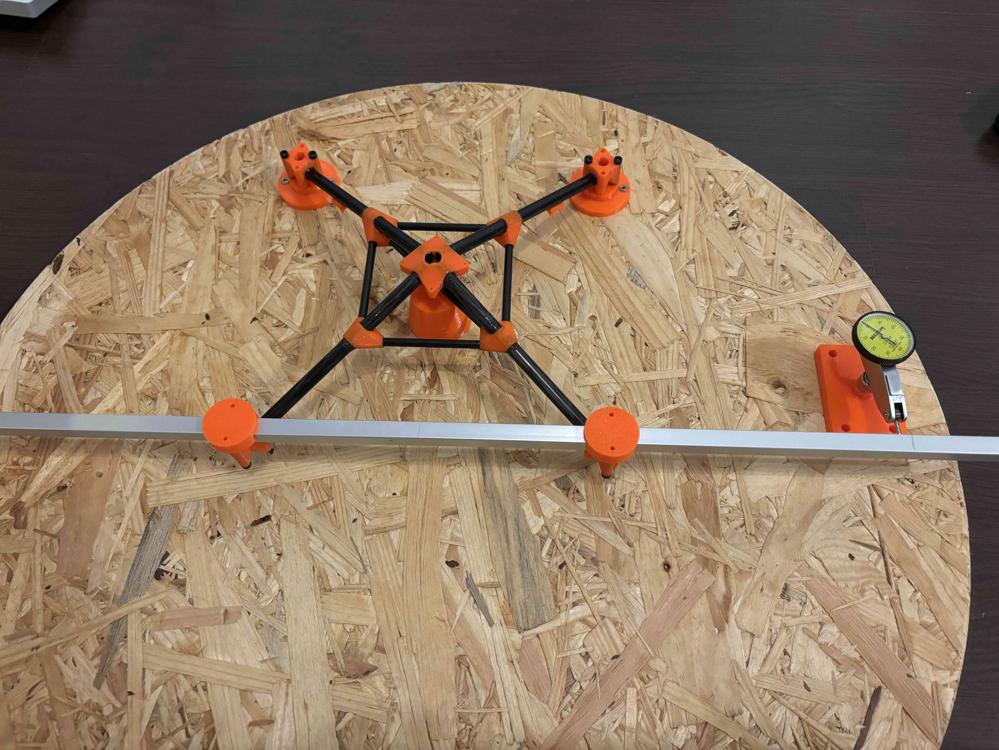
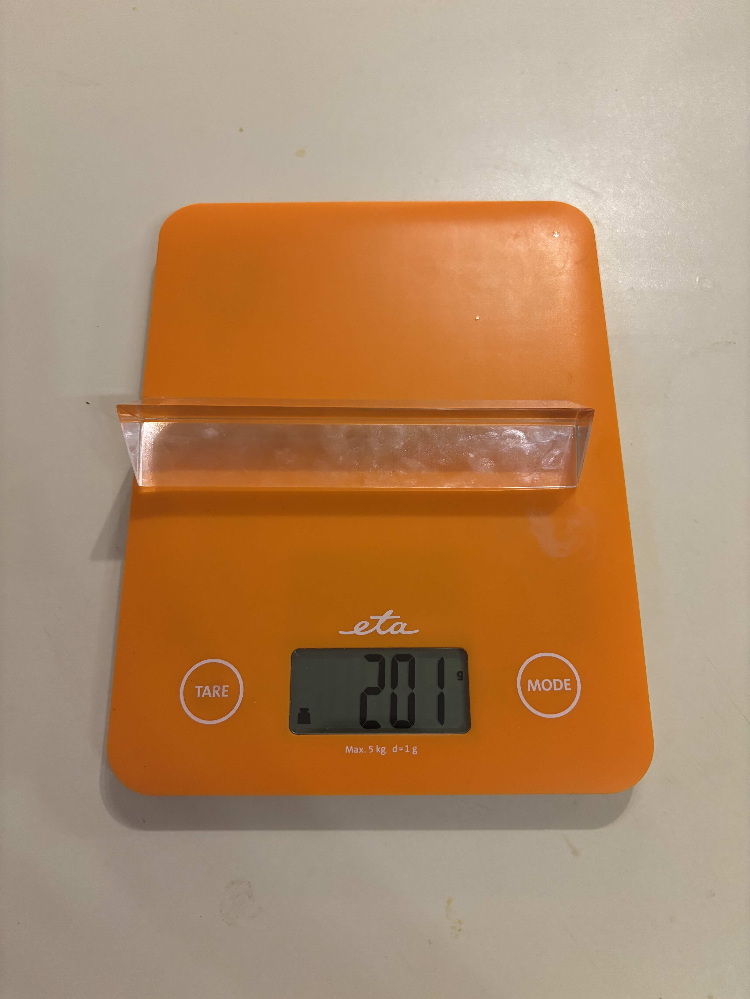
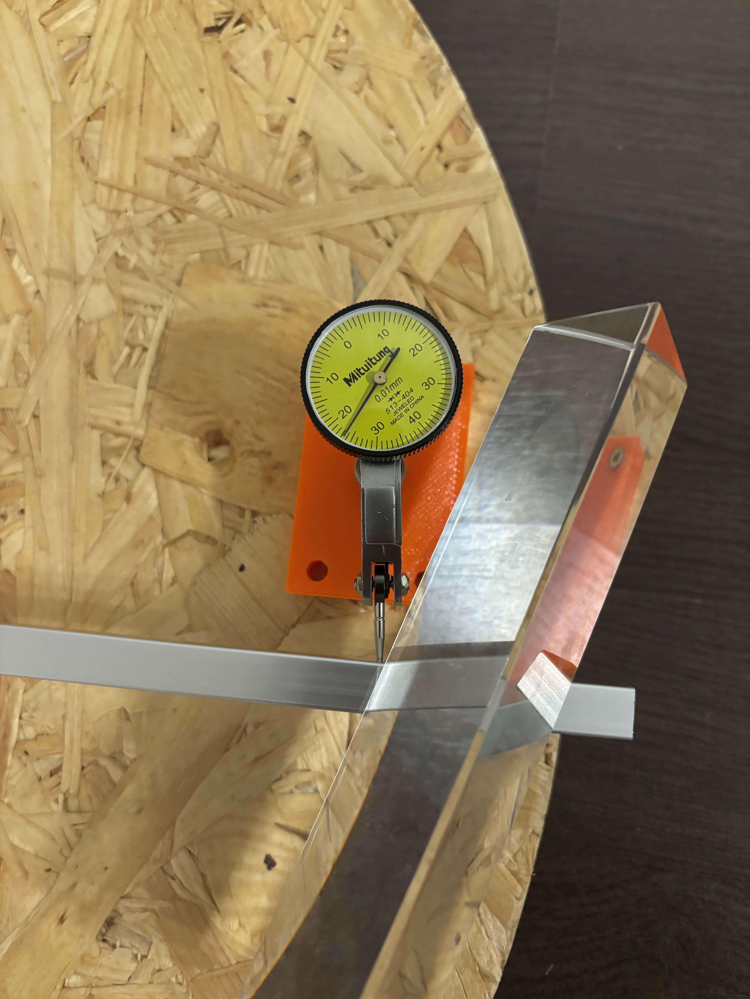

# Stiffness comparison: Spacedrone vs standard 7" frame

This document summarizes a simple stiffness comparison between a conventional 7" quad frame and the 7" Spacedrone frame. The goal was to quantify how the spaceframe design and carbon tubing perform under bending and torsion compared to a typical plate-based frame.

## Test frames

| Frame        | Complete frame weight | Construction        |
|-------------|------------------------|----------------------|
| **Stock**   | 141 g                  | Conventional plate-based 7" frame |
| **Spacedrone** | 65 g                | Carbon tubing spaceframe with 3D-printed nodes |

The Spacedrone frame is roughly **half the weight** of the stock frame while targeting similar or better stiffness in key directions.

---

## Bending stiffness (top load)

A **3 kg** weight was applied vertically at the top centre of the frame (above the flight controller area). Displacement was measured at the load point.

### Results

| Frame       | Displacement | Relative stiffness |
|------------|--------------|--------------------|
| Stock      | 0.97 mm      | 1× (baseline)      |
| Spacedrone | 0.14 mm      | **~7× stiffer**    |

The Spacedrone frame showed **about 7× higher bending stiffness** under this load, with 0.14 mm deflection vs 0.97 mm for the stock frame.

### Test setup (Spacedrone)

*Bending test setup: 3 kg weight applied at the top centre.*

### Loaded (comparison)

**Spacedrone under 3 kg load (0.14 mm displacement):**

**Stock frame under same 3 kg load (0.97 mm displacement):**

---

## Torsional stiffness

A **200 g** weight was placed **27 cm** from the centre of rotation to apply a torsional moment. Displacement was measured at the point of load.

### Results

| Frame       | Displacement | Relative stiffness |
|------------|--------------|--------------------|
| Stock      | 1.04 mm      | 1× (baseline)      |
| Spacedrone | 0.73 mm      | **~1.4× stiffer**  |

The Spacedrone frame was **more than 1.4× stiffer in torsion**, with 0.73 mm vs 1.04 mm displacement.

### Test setup (Spacedrone)

*Torsional test setup: 200 g weight at 27 cm from centre.*

### Torsional load (200 g @ 27 cm)

*Weight used for torsional moment.*

*Spacedrone under torsional load (0.73 mm displacement).*

---

## Summary

| Test           | Stock (141 g) | Spacedrone (65 g) | Spacedrone advantage |
|----------------|---------------|-------------------|------------------------|
| **Bending** (3 kg top) | 0.97 mm   | 0.14 mm           | **~7× stiffer**        |
| **Torsion** (200 g @ 27 cm) | 1.04 mm | 0.73 mm       | **~1.4× stiffer**      |

At roughly **54% less frame weight**, the 7" Spacedrone achieves:

- **~7×** higher bending stiffness (top load).
- **~1.4×** higher torsional stiffness.

This supports the design goal of a lightweight, stiff frame suitable for aggressive flying and low-vibration operation without hot motors or excessive flex.
